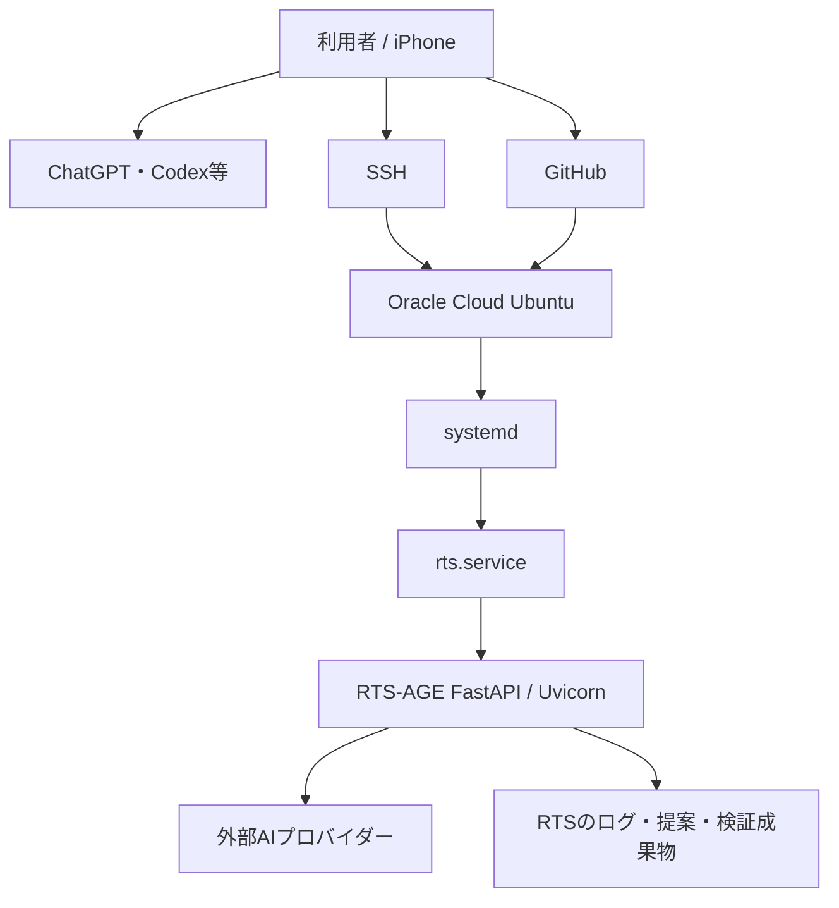

# 初心者向け RTS-AGE スタートアップガイド

## この環境は何をしているのか

この環境は、スマートフォンを操作端末にし、AIを設計・実装・確認の補助役として使い、GitHubにコードと履歴を残し、Oracle Cloud上のUbuntuでAI用の接続サーバーを常時動かすための開発環境です。

初心者向けに言い換えると、役割は次のようになります。

| 部品 | 役割のたとえ | 実際の役割 |
| --- | --- | --- |
| iPhone | 操縦席 | ChatGPT、GitHub、SSH、Safariを操作する |
| ChatGPT / Codex等 | 技術チーム | 要件整理、コマンド作成、実装、監査を補助する |
| GitHub | 倉庫と履歴帳 | コード、ブランチ、PR、判断、変更履歴を保存する |
| Oracle Cloud | 24時間使える作業場 | Ubuntuサーバーを常時稼働させる |
| Ubuntu | 作業場の基本設備 | ファイル、ネットワーク、プロセス、更新を管理する |
| systemd | 起動・監視係 | `rts.service` を起動し、失敗時に再起動する |
| RTS-AGE | AI接続ゲートウェイ | Claude Code形式の通信を外部AI向けに変換する |
| 外部AIプロバイダー | 実際に考えるエンジン | NVIDIA NIM、OpenRouter、DeepSeek等で応答を生成する |

## 全体構成



## 現在の本番経路

現在確認できている本番経路は次のとおりです。

```text
Oracle Cloud
  └─ Ubuntu 24.04.4 LTS
      └─ systemd
          └─ rts.service
              └─ /home/ubuntu/free-claude-code/.venv/bin/python server.py
                  └─ 127.0.0.1:8082
```

重要なのは、現在の8082番ポートが `127.0.0.1` のみで待ち受けていることです。

これは「サーバーの中からだけ接続できる」状態を意味します。インターネット側やサーバーのプライベートIPから直接8082番へ接続する構成ではありません。

## 認証の考え方

RTS-AGEには認証トークンが設定されています。

- 認証なしで保護対象へアクセスすると `401`
- 正しい認証情報を付けると `200`
- `/health` は稼働確認用として `200`

認証情報はGitHubや画面出力へ書かず、サーバー内の権限制限されたファイルに保存します。

現在の保存場所は次のとおりです。

```text
/home/ubuntu/free-claude-code/.env
/home/ubuntu/.config/rts/client.env
```

両方ともファイル権限 `600`、つまり所有者だけが読み書きできる状態です。

## 本番と候補版を分ける理由

この環境では、本番コードをその場で更新せず、別の作業コピーで候補版を確認します。

```text
本番
/home/ubuntu/free-claude-code
└─ 現在動いているサービス

候補版
/home/ubuntu/RTS-AGE
└─ 最新mainを同期し、依存関係とテストを確認する場所
```

この分離により、候補版の同期やテストに失敗しても、本番8082番を止めずに済みます。

## 安全な標準作業フロー

### 1. 現在の状態を確認する

最初に、本番が動いているか、未保存変更がないかを確認します。

確認する代表例：

- `systemctl is-active rts.service`
- `/health` がHTTP `200`
- Gitの変更数が `0`
- 使用予定ポートが空いている

### 2. バックアップを作る

変更前に、少なくとも次を保存します。

- `.env`
- `rts.service`
- 現在のGitコミット
- インストール済みパッケージ情報

秘密情報を含むバックアップは、所有者だけが読めるディレクトリへ置きます。

### 3. 候補コピーを最新mainへ同期する

本番コピーではなく `/home/ubuntu/RTS-AGE` を更新します。

安全確認：

- ローカル変更がない
- `origin/main` が確認済みコミットと一致する
- fast-forwardだけで更新できる

### 4. 候補版の依存関係を作る

このリポジトリは `uv` とPython 3.14を使用します。

```bash
cd /home/ubuntu/RTS-AGE
uv sync --frozen
```

`--frozen` は、ロックファイルに記録された依存関係から勝手に変更しないための指定です。

### 5. 自動テストを実行する

```bash
uv run --frozen pytest
```

本番のメッセージ連携を二重起動しないよう、候補試験ではTelegramやDiscord等を無効にして実行します。

テスト中は画面に出力せずログへ保存することがあります。その場合、画面が静かでも停止しているとは限りません。

### 6. 別ポートで並行起動する

テスト成功後、候補版を本番とは別のポートで一時起動します。

```text
本番      127.0.0.1:8082
候補試験  127.0.0.1:18082
```

ここで確認すること：

- `/health` が `200`
- 認証なしが `401`
- 認証ありが `200`
- `/v1/models` が `200`
- 18082番がループバック限定
- 本番8082番も引き続き `200`

### 7. 人間が切り替えを承認する

候補版が動いても、自動的に本番へ切り替えません。

次を確認してから人間が判断します。

- テスト結果
- 変更量
- 互換性
- バックアップ
- ロールバック手順
- 本番停止時間

### 8. 本番切り替え後に再確認する

最低限、次を確認します。

- `ActiveState=active`
- `SubState=running`
- `NRestarts=0`
- `/health=200`
- 認証なし `401`
- 認証あり `200`
- 非ループバック待受 `0`
- journalに警告・エラーがない

### 9. 作業結果を記録する

変更後は次を更新します。

- `docs/operations/CURRENT_ENVIRONMENT.md`
- `docs/operations/ENVIRONMENT_CHANGELOG.md`
- 必要に応じて `docs/STATUS.md` と `docs/NEXT.md`

## よく出る表示の意味

| 表示 | 意味 |
| --- | --- |
| `active` | サービスが稼働している |
| `inactive` | サービスが停止している |
| HTTP `200` | 正常に応答した |
| HTTP `401` | 認証が必要、または認証情報が違う |
| HTTP `404` | サーバーは応答したが、そのURLは存在しない |
| HTTP `5xx` | アプリ側でエラーが起きた可能性がある |
| `changes=0` | Gitで未保存変更がない |
| `NRestarts=0` | 起動失敗による再起動を繰り返していない |
| `>` | シェルがコマンドの続きを待っている |

## `>` が表示されたとき

長いコマンドが途中で切れると、画面に次の記号が出ます。

```text
>
```

これはサーバーが壊れた表示ではなく、bashが閉じていない引用符やコマンドの続きを待っている状態です。

その場合は `Ctrl+C` で中断し、短い確認コマンドを実行します。

スマートフォンでは長大な一行コマンドが途中で切れやすいため、作業を次のように分割します。

1. 同期
2. 依存関係
3. テスト
4. 一時起動
5. 本番切り替え
6. 最終確認

## やってはいけないこと

- APIキーや認証トークンをGitHubへ保存しない。
- 本番コピーを最初に更新しない。
- テスト結果が出る前に本番を切り替えない。
- 8082番を理由なく `0.0.0.0` で公開しない。
- SSHを許可したことを確認せずファイアウォール設定を変更しない。
- 長いコマンドを途中で切れたまま続行しない。
- 出力を確認せず「成功」と判断しない。
- 未確認事項を確認済みとして文書へ書かない。

## 初心者が最初に覚える三つ

### 1. 本番と候補版は別物

候補版で試し、本番は最後に切り替えます。

### 2. `200`だけでは安全確認にならない

認証、待受アドレス、Git差分、ログ、再起動回数も確認します。

### 3. 作業記録はコードと同じくらい重要

何をしたかが残っていなければ、次回の自分や別のAIが安全に再開できません。

## 現在地の確認先

最新の実構成と進行状態は次を参照してください。

- [`../operations/CURRENT_ENVIRONMENT.md`](../operations/CURRENT_ENVIRONMENT.md)
- [`../operations/ENVIRONMENT_CHANGELOG.md`](../operations/ENVIRONMENT_CHANGELOG.md)

このガイドは操作の考え方を説明するものであり、秘密情報を含む実際の設定値やトークンは記載しません。
